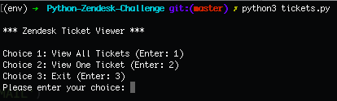

# Zendesk Ticket Retriever

CLI Python interface for retrieving customer service tickets.
(in development)

## To Use

### Requisites

- Python3

### Installation
Clone this repo into the directory of your choice via terminal, using the following command:

`git clone git@github.com:MackRoe/PythonZendeskChallenge.git`

### To Run

This program is designed to be run within a virtual environment. In terminal, within the directory where you've cloned the code, install the virtual environment by entering:

`python3 -m venv env`

 Activate the virtual environment by entering:

`source env/bin/activate`

Then install the requirements by running:

`pip3 install -r requirements.txt`

Then enter the following to run the program:

`python3 tickets.py`

You should see the following:

Enter your choice to see the program in action!

*As of most recent commit, choice options 2 and 3 are functional. Choice 1 causes an error that reads as follows*

"Status: 400 Server Unavailable: Attempt Aborted."
